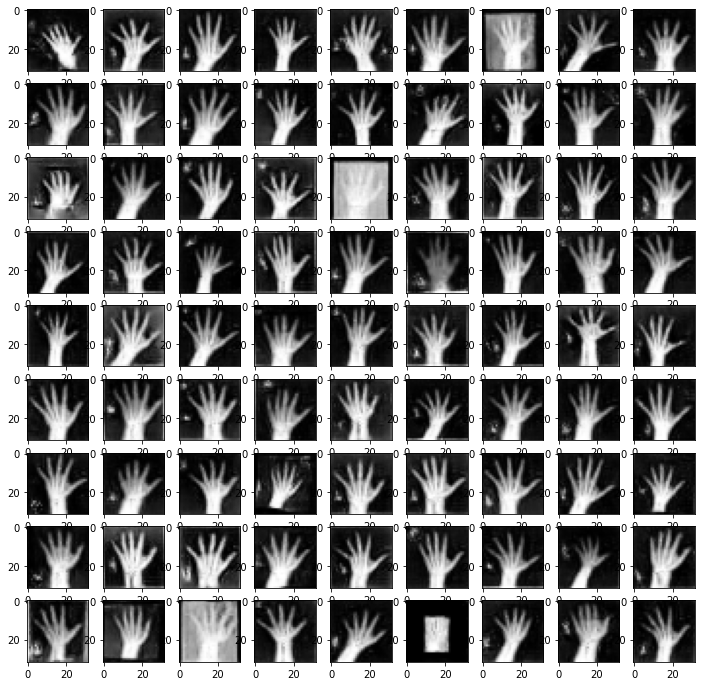

This repo was taken from 2 coursework projects in my university's "Deep Learning" module. The projects were done under time constraints. This repo's goal is to display my Deep Learning and PyTorch abilities, including advanced deep learning topics like GANs, which were state-of-the-art technology just a few years ago. 

- Note: the training set had small reference objects in all images which are the dots you see
- Note: The training set had almost entirely left hands

# Hand image generation

## `image_generation.ipynb`

In this file, I go through my normal Deep Learning workflow. I used a Deep Convolutional GAN to generate X-ray images of Hands. I define my dataset class, split data, create my training loops etc.

## `model_selection.ipynb`

In this file, I show the process I used to tune my GAN. As you can see below the vast majority of the images look like real hands. I calculate a 90.12% success rate based on observation.

# Hand image classification

## `image_classification.ipynb`

In this file, I go through my normal Deep Learning workflow. I used a CNN to classify images that belonged to 3 classes. Real X-ray images, images generated with GANs and images generated by VAEs. I define my dataset class, split data, create my training loops etc.

## `model_selection.ipynb`

In this file, I show the process I used to tune my CNN. 

|                           | weighted f1-score | accuracy |
| ------------------------- | ----------------- | -------- |
| **Dummy/Untrained model** | 34.72%            | 51.55%   |
| **Final model**           | 81%               | 79.86%   |
